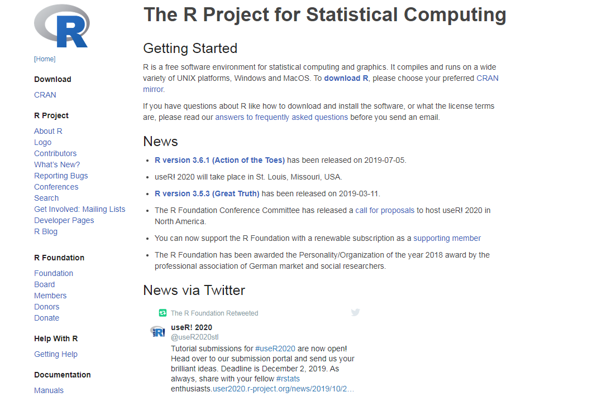
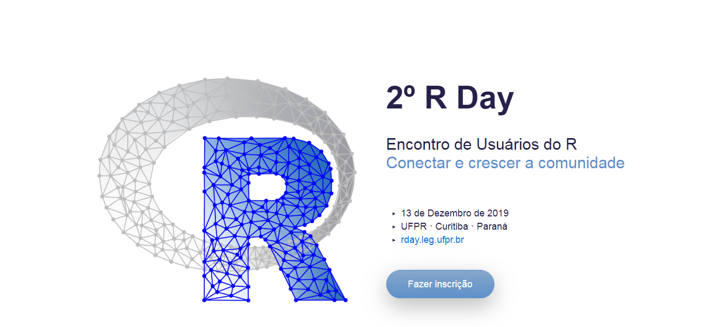
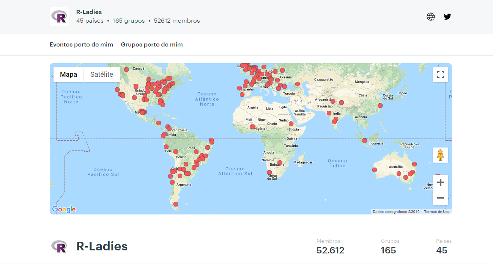
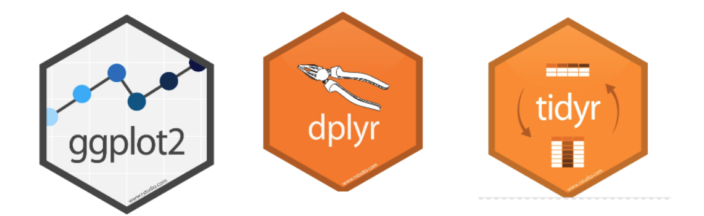
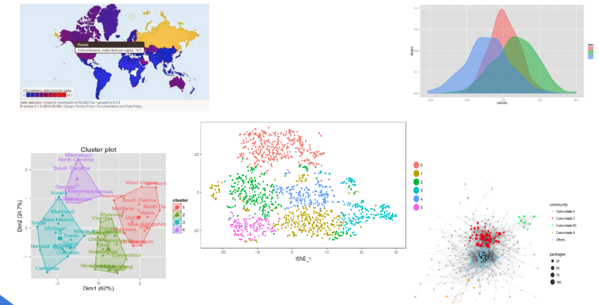
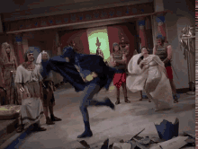

class: inverse, middle, center
background-image: url("index_files/figure-html/r-logo.jpg")
background-size: contain


---

class: inverse, center, middle

# Conhecendo o R

---

# O que é R?

* Linguagem de programação de código aberto, criada no início dos anos 90 pelos estatísticos Robert Gentleman e Ross Ihaka, na Nova Zelândia. 


--
* Criada a partir da linguagem proprietária S.


--

* Posteriormente, foi desenvolvida em um esforço colaborativo em vários locais do mundo.

--

* Fornece um amplo espectro de técnicas gráficas e estatísticas em mais de 2000 pacotes.

--

* Também é possível programar métodos próprios para funcionalidades específicas.

---
# Por que R?

* Código aberto

--

* Grande número de documentação/material disponível

--

* Mais leve e dinâmico

--

* Atualizações e correções constantes

--

* Integra com outras ferramentas e linguagens: LaTeX, Markdown, HTML, etc

--

* Ampla e ativa comunidade de usuários


---
```{r echo=FALSE, fig.align='center', message=FALSE, warning=FALSE, out.width='50%', paged.print=FALSE}
 knitr::include_graphics('https://www.oreilly.com/library/view/the-art-of/9781593273842/httpatomoreillycomsourcenostarchimages915868.png.jpg')
```

---

class: inverse, center, middle

# A importância da comunidade

---

background-image:  url("index_files/figure-html/minions.gif")
background-size: cover
class: center, inverse

---

# Comunidade global

* A comunidade constrói o R


* Fóruns


* Sites e repositórios


* Encontros e meetups

---

class: inverse, center

```{r echo=FALSE, fig.align='center', message=FALSE, warning=FALSE, out.width='120%', paged.print=FALSE}
 
```


# R Foundation

---
class: inverse, center

```{r echo=FALSE, fig.align='center', message=FALSE, warning=FALSE, out.width='120%', paged.print=FALSE}
 
```


# useR!

---
class: inverse, center


```{r echo=FALSE, fig.align='center', message=FALSE, warning=FALSE, out.width='120%', paged.print=FALSE}
 
```

# LatinR
---

class: inverse, center

```{r echo=FALSE, fig.align='center', message=FALSE, warning=FALSE, out.width='120%', paged.print=FALSE}
 
```

# RDay
---

class: inverse, center

```{r echo=FALSE, fig.align='center', message=FALSE, warning=FALSE, out.width='120%', paged.print=FALSE}
 
```

# R-Ladies

---
class: inverse, center 
.center[]

.center[]

# Comunidade Porto Alegre

---
class: inverse, middle, center

# Por que aprender R?

---
background-image:  url("index_files/figure-html/dancecomputer.gif")
background-size: cover
class: center, inverse

---

# Dados 

Possui várias das melhores ferramentas para construção de visualizações profissionais e pacotes para manipular os dados em poucas linhas de códigos.

Capacidade de tratar grandes volumes de dados.

.center[]

---

background-image:  url("index_files/figure-html/braveheart.gif")
background-size: cover
class: center, inverse

# DATA!!
---
class: inverse, center

```{r echo=FALSE, fig.align='center', message=FALSE, warning=FALSE, out.width='120%', paged.print=FALSE}
 
```

# Infinitas possibilidades

---
class: inverse, center, middle

# Plano das aulas
---

**Aula 1 Introdução**
Data: **30/10** 
1. Apresentação 

2. Conhecendo o ambiente 

3. Pacotes e ajuda 

4. Primeiros passos

5. Objetos e classes de objetos 

6. Vetores

**Aula 2 Objetos avançados** 
Data: **06/11** 
1. Factors

2. Matrizes 

3. Dataframes

4. Listas

---
**Aula 3 Manipulando dados** 
Data: **13/11** 

1. Importando bancos de dados

2. Tratamento inicial dos dados 

3. Estatísticas descritivas 

4. _[Tidyverse](https://www.tidyverse.org/)_ e o pacote _[dplyr](https://dplyr.tidyverse.org/)_

5. Exportando bancos de dados


**Aula 4 Visualização dos dados** 
Data: **20/11** 
1. Gráficos básicos no R 

2. O pacote _[ggplot2](https://ggplot2.tidyverse.org/)_  

3. Exportando gráficos  

**Aula 5 Apresentação dos dados e relatórios dinâmicos**
Data: **04/12** 
1. O _[Markdown](https://www.markdownguide.org/)_ e o pacote _[RMarkdown](https://rmarkdown.rstudio.com/)_

2. Confecção de relatórios\par

---
# Adicionais (optativos)

* Listas de exercícios

* Projeto final

# Toda documentação do curso

* Disponível no repositório do Gitlab

# Contato

* Sempre por e-mail! <iaracpassos@gmail.com>

---
class: inverse, center, middle

# Algumas considerações antes de começarmos

---
class: inverse, center

```{r echo=FALSE, fig.align='center', message=FALSE, warning=FALSE, out.width='60%', paged.print=FALSE}
 
```

---
class: inverse, center, middle

# R é uma linguagem e ambiente de programação.
--

## Muito diferente de outros programas mais utilizados (SPSS, Excel, etc).

--
## O curso, apesar de introdutório, tem muito conteúdo!! 

---
```{r echo=FALSE, fig.align='center', message=FALSE, warning=FALSE, out.width='65%', paged.print=FALSE}
 knitr::include_graphics('index_files/figure-html/elnb.gif')
```

---
class: inverse, center, middle

# Dica nº 1
---
background-image:  url("index_files/figure-html/payatention.gif")
background-size: cover
class: center, inverse

---
class: inverse, center, middle

# Dica nº 2
---
background-image:  url("index_files/figure-html/late.gif")
background-size: cover
class: center, inverse

---
class: inverse, center

# Dica nº 3

```{r echo=FALSE, fig.align='center', message=FALSE, warning=FALSE, out.width='70%', paged.print=FALSE}
 
```

# Detalhes importam!
---
class: inverse, center, middle

# No R, cada detalhe importa para o código rodar.

--

# Portanto, é muito comum o código não rodar por causa de erros. 

---
class: inverse, center

```{r echo=FALSE, fig.align='center', message=FALSE, warning=FALSE, out.width='100%', paged.print=FALSE}
 
```

# Como NÃO lidar com erros
---
class: inverse, center, middle

```{r echo=FALSE, fig.align='center', message=FALSE, warning=FALSE, out.width='90%', paged.print=FALSE}
 
```

# Continua dando erro?


---
class: inverse, center, middle

# Dica nº 4

---

class: inverse, center, middle

# Não se desespere!!

---

class: inverse, center

```{r echo=FALSE, fig.align='center', message=FALSE, warning=FALSE, out.width='85%', paged.print=FALSE}
 
```

# Respire fundo! 
---
class: inverse, center

```{r echo=FALSE, fig.align='center', message=FALSE, warning=FALSE, out.width='80%', paged.print=FALSE}
 
```

# Peça ajuda!
---

class: inverse, center

```{r echo=FALSE, fig.align='center', message=FALSE, warning=FALSE, out.width='80%', paged.print=FALSE}
 
```

# **NÃO** desista! 

---
class: inverse, center

```{r echo=FALSE, fig.align='center', message=FALSE, warning=FALSE, out.width='80%', paged.print=FALSE}
 
```

# Uma hora a gente encontra o erro!
---

# Tá tudo indo tranquilo?

--

# Ajude o colega!

--
```{r echo=FALSE, fig.align='center', message=FALSE, warning=FALSE, out.width='80%', paged.print=FALSE}
 
```

---

class: inverse, center, middle

# Dica nº 5
---

class: inverse, center, middle

# Vamos aprender vários conceitos/definições novas


---
class: inverse, center, middle

```{r echo=FALSE, fig.align='center', message=FALSE, warning=FALSE, out.width='90%', paged.print=FALSE}
 
```

# É normal não entendermos algo!
---
class: inverse, center

```{r echo=FALSE, fig.align='center', message=FALSE, warning=FALSE, out.width='80%', paged.print=FALSE}
 
```

# Ficou com dúvida?
---
class: inverse, center, middle

# Pergunte!
---

class: inverse, center, middle

# Dica nº 6

---
class: inverse, center

```{r echo=FALSE, fig.align='center', message=FALSE, warning=FALSE, out.width='80%', paged.print=FALSE}
 knitr::include_graphics('index_files/figure-html/cat-exercise.gif')
```

# Faça os exercícios!

---


class: inverse, center, middle

# Dica nº 7

---

class: inverse, center

```{r echo=FALSE, fig.align='center', message=FALSE, warning=FALSE, out.width='80%', paged.print=FALSE}
 
```

# Tentativa e erro
---
class: inverse, center, middle


# No final vai dar tudo certo!

## O código vai rodar!!

---
background-image:  url("index_files/figure-html/alive.gif")
background-size: cover
class: center, inverse

---
class: inverse, center, middle

# Regra nº 1
--

## Ninguém fica 
--

##  pra trás!

---
background-image:  url("index_files/figure-html/catdeal.gif")
background-size: cover
class: center, inverse
---
class: inverse, center, middle

# Regra nº 2

---
class: inverse, center

```{r echo=FALSE, fig.align='center', message=FALSE, warning=FALSE, out.width='80%', paged.print=FALSE}
 
```


# Estamos aqui para nos divertir! 

---

class: inverse, center

```{r echo=FALSE, fig.align='center', message=FALSE, warning=FALSE, out.width='80%', paged.print=FALSE}
 knitr::include_graphics('index_files/figure-html/dance.gif')
```


# Vamos aprender R? 
---
background-image:  url("index_files/figure-html/yes2.gif")
background-size: cover
class: center, inverse

---

class: inverse, center

```{r echo=FALSE, fig.align='center', message=FALSE, warning=FALSE, out.width='80%', paged.print=FALSE}
 
```

### Slides created via the R package [**xaringan**](https://github.com/yihui/xaringan).


